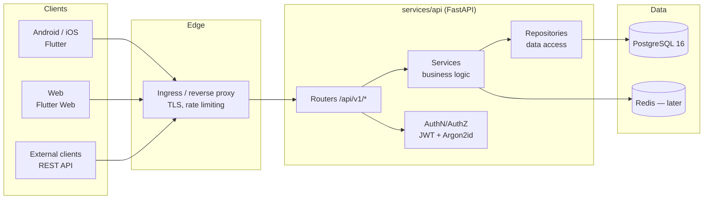

# Architecture

## Technology selection (ADR summary)

| Decision | Choice | Alternatives considered | Rationale |
|---|---|---|---|
| Mobile/tablet client | Flutter 3 (Dart) | React Native, native Kotlin/Swift | Single codebase for Android, iOS, and tablets; mature store distribution; strong responsive layout support. |
| Web client | Flutter Web (shared codebase) | React + TypeScript | Shares models, API client, and most UI logic with mobile. Accepted trade-off: larger initial JS payload than React. Revisit if SEO/public marketing pages are ever needed (those would be a separate static site). |
| Backend | Python 3.12 + FastAPI | Spring Boot, ASP.NET Core | Async-first, Pydantic v2 validation, automatic OpenAPI/Swagger, fast iteration, excellent test tooling (pytest, httpx). |
| ORM / migrations | SQLAlchemy 2.0 (async) + Alembic | Django ORM, raw SQL | Explicit, migration-friendly, works cleanly with async FastAPI. |
| Database | PostgreSQL 16 | MySQL, SQLite | JSONB (receipts/OCR metadata), strong numeric types, row-level security for future multi-tenancy, direct RDS portability. |
| Auth | JWT access + rotating refresh tokens, Argon2id | Session cookies, OAuth-only | Stateless API suits mobile + web + external clients; refresh rotation gives revocable sessions; OAuth2-password-flow compatible so an external IdP can be adopted later. |
| Cache / rate limiting | Redis (Phase 11) | In-process | Needed for distributed rate limiting and token denylists once horizontally scaled; deferred until hardening phase. |
| Containers | Docker, compose for dev | Podman | Team standard; compose gives one-command local stack. |
| Orchestration | Kubernetes + Kustomize | Helm | Kustomize overlays (dev/prod) are FluxCD-native and keep manifests plain YAML. |
| CI/CD | Jenkins → OCI registry → GitOps repo → FluxCD | GitHub Actions only | Matches the target private-cloud flow; GitHub kept for source control and optional lightweight checks. |

## High-level architecture



## Backend layering (clean architecture)

```
services/api/
├── app/
│   ├── main.py              # App factory, middleware, exception handlers
│   ├── core/                # config (env), security, logging, exceptions
│   ├── api/v1/              # Routers (thin: parse, authorize, delegate)
│   ├── schemas/             # Pydantic DTOs (request/response, validation)
│   ├── services/            # Business logic (framework-agnostic where practical)
│   ├── repositories/        # SQLAlchemy data access, user-scoping enforced here
│   ├── models/              # SQLAlchemy ORM models
│   └── db/                  # Engine, session, base
├── tests/                   # unit + integration (pytest)
├── alembic/ -> ../../database/alembic (single source of truth)
└── requirements.txt / pyproject.toml
```

Rules:
- Routers never contain business logic or SQL.
- Services never import FastAPI request objects; they receive typed DTOs.
- Repositories enforce `user_id` scoping on every query (data isolation is a data-layer guarantee, not a router convention).
- Schemas (DTOs) are the only objects crossing the API boundary — ORM models are never serialized directly.

## Multi-tenancy & commercial posture

- **Now:** single-tenant-per-user. Every owned table carries `user_id`; isolation enforced in repositories.
- **Later:** a `households`/`tenants` table is inserted *above* users; owned tables gain `tenant_id` via an additive migration. UUID primary keys and repository-level scoping make this a contained change.
- **Billing:** a `BillingService` interface boundary will exist in the service layer (Phase 11) with a no-op "free tier" implementation. No payment code before then.
- **Scaling:** stateless API pods scale horizontally; Postgres via connection pooling (PgBouncer later); Redis for shared rate-limit state.

## AWS portability

No cloud-specific services are used. On AWS the mapping is: EKS (Kubernetes), RDS PostgreSQL (same engine), ElastiCache Redis, ALB ingress, ECR registry. Application changes required: none beyond environment configuration.
