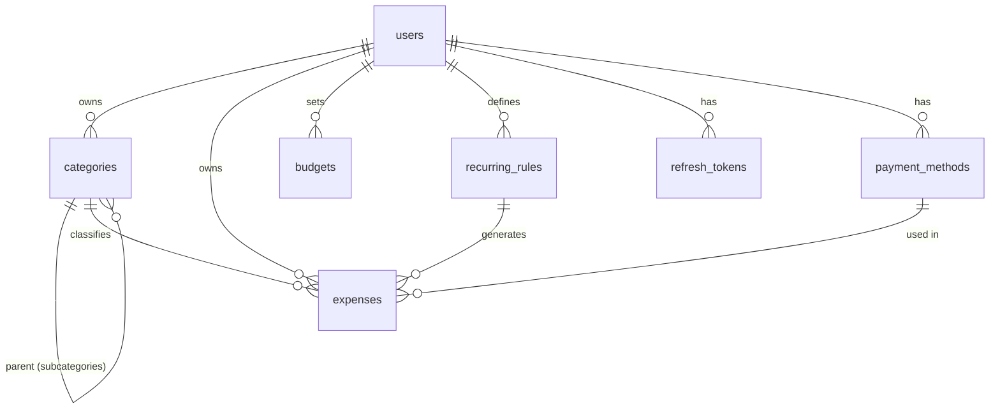

# Database schema (v1)

Engine: PostgreSQL 16. Migrations: Alembic (in `database/alembic`). All money is `NUMERIC(14,2)` — never float. All timestamps are `timestamptz` UTC. All PKs are UUIDv4 (application-generated).

## ERD

## Tables

### users
| Column | Type | Notes |
|---|---|---|
| id | uuid PK | |
| email | citext UNIQUE | case-insensitive login |
| password_hash | text | Argon2id |
| display_name | varchar(100) | |
| default_currency | char(3) | ISO 4217, default `EUR` |
| role | varchar(20) | `user` \| `admin` — RBAC-ready |
| is_active | boolean | soft account disable |
| created_at / updated_at | timestamptz | audit |

### categories
| Column | Type | Notes |
|---|---|---|
| id | uuid PK | |
| user_id | uuid FK → users | NULL = system default category |
| parent_id | uuid FK → categories, NULL | self-reference → subcategories (one level enforced in service layer) |
| name | varchar(80) | unique per (user_id, parent_id) |
| kind | varchar(10) | `expense` \| `income` — income tracking ready |
| is_archived | boolean | hide without deleting history |
| created_at / updated_at | timestamptz | |

### payment_methods
| Column | Type | Notes |
|---|---|---|
| id | uuid PK | |
| user_id | uuid FK | |
| name | varchar(80) | e.g. "Visa ****1234", "Cash" |
| type | varchar(20) | `cash` \| `card` \| `bank` \| `other` |
| is_archived | boolean | |
| created_at / updated_at | timestamptz | |

### expenses
| Column | Type | Notes |
|---|---|---|
| id | uuid PK | |
| user_id | uuid FK | isolation key — indexed |
| category_id | uuid FK | |
| payment_method_id | uuid FK, NULL | |
| recurring_rule_id | uuid FK, NULL | set when generated by a rule |
| amount | numeric(14,2) | > 0, check constraint |
| currency | char(3) | ISO 4217 |
| expense_date | date | indexed (reporting) |
| description | varchar(200) | |
| notes | text, NULL | |
| metadata | jsonb | future: receipt refs, OCR payloads |
| created_at / updated_at | timestamptz | |
| deleted_at | timestamptz, NULL | soft delete → audit & restore |

Indexes: `(user_id, expense_date)`, `(user_id, category_id)`, partial index on active rows (`deleted_at IS NULL`).

### recurring_rules
| Column | Type | Notes |
|---|---|---|
| id | uuid PK | |
| user_id | uuid FK | |
| category_id / payment_method_id | uuid FK | template for generated expenses |
| amount / currency | numeric / char(3) | |
| description | varchar(200) | |
| frequency | varchar(10) | `daily` \| `weekly` \| `monthly` \| `annual` |
| next_run_date | date | scheduler picks due rules |
| is_active | boolean | |
| created_at / updated_at | timestamptz | |

### budgets
| Column | Type | Notes |
|---|---|---|
| id | uuid PK | |
| user_id | uuid FK | |
| category_id | uuid FK, NULL | NULL = overall budget |
| amount | numeric(14,2) | |
| period | varchar(10) | `weekly` \| `monthly` \| `annual` |
| start_date | date | |
| created_at / updated_at | timestamptz | |

### refresh_tokens
| Column | Type | Notes |
|---|---|---|
| id | uuid PK | |
| user_id | uuid FK | |
| token_hash | text UNIQUE | only the hash is stored |
| expires_at | timestamptz | |
| revoked_at | timestamptz, NULL | rotation revokes predecessor |
| created_at | timestamptz | |

## Future additive tables (designed for, not built)

`accounts` (bank/cash balances), `income` (uses `categories.kind='income'`), `households` + `household_members` (shared tenancy), `receipts` (object-storage refs, links via `expenses.metadata`), `subscriptions` + `plans` (billing), `audit_log` (if compliance requires beyond row timestamps).

## Backup / restore strategy

- **Local dev:** named Docker volume `pgdata`; `scripts/backup-db.ps1` runs `pg_dump` to timestamped file.
- **Production (later):** scheduled `pg_dump` CronJob to object storage, plus WAL archiving / PITR on RDS if migrated to AWS. Restore procedure documented and rehearsed per release.
